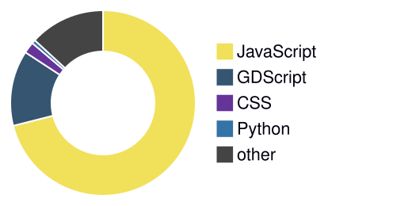

# Cocoasaur

**Computer Science Student · Philippines**

Driven by curiosity and a dedication to solving real-world problems — exploring new technologies, building challenging projects, and continuously learning to grow as a developer.

## About Me

<table>
  <tr>
    <td width="70%">
      I'm a Computer Science student from the Philippines, driven by curiosity and dedication to solving real-world problems.
      I enjoy exploring new technologies, building projects that challenge me, and continuously learning to grow as a developer.
      My goal is to craft solutions that are not only functional, but also meaningful and impactful.
    </td>
    <td align="center">
      
    </td>
  </tr>
</table>

## Tech Stack

<table>
  <tr>
    <th>Languages</th>
    <td>
      
      
      
      
    </td>
  </tr>
  <tr>
    <th>Frontend</th>
    <td>
      
      
      
      
    </td>
  </tr>
  <tr>
    <th>Databases</th>
    <td>
      
      
    </td>
  </tr>
  <tr>
    <th>Data & AI</th>
    <td>
      
      
      
      
    </td>
  </tr>
  <tr>
    <th>Design</th>
    <td>
      
      
      
      
    </td>
  </tr>
  <tr>
    <th>Tools</th>
    <td>
      
      
    </td>
  </tr>
</table>

## GitHub Stats

<picture>
  <source media="(prefers-color-scheme: dark)" srcset="https://github-readme-stats.vercel.app/api?username=Cocoasaur&theme=dark&hide_border=false&include_all_commits=false&count_private=false"/>
  
</picture>
 

<picture>
  <source media="(prefers-color-scheme: dark)" srcset="https://nirzak-streak-stats.vercel.app/?user=Cocoasaur&theme=dark&hide_border=false"/>
  
</picture>
 

### Contribution Calendar

<picture>
  <source media="(prefers-color-scheme: dark)" srcset="metrics.plugin.isocalendar.fullyear.dark.svg"/>
  
</picture>

### Most Used Languages

## Achievements

<picture>
  <source media="(prefers-color-scheme: dark)" srcset="metrics.plugin.achievements.dark.svg"/>
  
</picture>

## Notable Contributions

<picture>
  <source media="(prefers-color-scheme: dark)" srcset="metrics.plugin.notable.dark.svg"/>
  
</picture>

---

  

